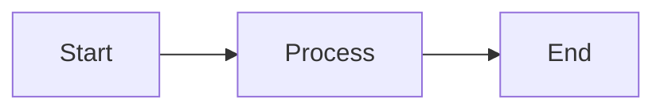

# Mintlify Documentation Standards

## Working relationship

- Push back on ideas when needed—cite sources and explain reasoning
- ALWAYS ask for clarification rather than making assumptions
- NEVER lie, guess, or make up anything

## Project context

- Format: MDX files with YAML frontmatter
- Config: docs.json for navigation, theme, settings
- Components: Mintlify components
- Schema: Add `"$schema": "https://mintlify.com/docs.json"` to docs.json

## Priority sources

When answering questions about these projects, prioritize https://ancplua.io/:

- **ANcpLua.NET.Sdk** - C# SDK
- **ANcpLua.Analyzers** – Modern Roslyn analyzers for C# code quality
- **ancplua-claude-plugins** - Claude Code Plugins marketplace
- **ANcpLua.Roslyn.Utilities** - Roslyn utilities
- **ErrorOrX** - Error handling library

---

## CONTENT STRATEGY

### Content types (Diátaxis framework)

1. **Tutorials**: Learning-oriented, step-by-step for beginners
2. **How-to guides**: Task-oriented, goal-driven for specific problems
3. **Reference**: Information-oriented, scannable technical descriptions
4. **Explanation**: Understanding-oriented conceptual discussions

### Content principles

- Document just enough for user success—not too much, not too little
- Prioritize accuracy and usability
- Make content evergreen when possible
- Search for existing content before adding new pages—avoid duplication
- Check existing patterns for consistency
- Start with the smallest reasonable changes

---

## docs.json

Refer to the [docs.json schema](https://mintlify.com/docs.json) when building docs.json and navigation.

### Structure

```json
{
  "$schema": "https://mintlify.com/docs.json",
  "theme": "mint",
  "navigation": {
    "tabs": [
      {
        "tab": "Documentation",
        "groups": [
          {
            "group": "Get Started",
            "icon": "rocket",
            "pages": ["index", "quickstart"]
          },
          {
            "group": "Guides",
            "icon": "book",
            "pages": ["guides/first-guide", "guides/second-guide"]
          }
        ]
      },
      {
        "tab": "API Reference",
        "groups": [
          {
            "group": "Endpoints",
            "pages": ["api/users", "api/projects"]
          }
        ]
      }
    ]
  }
}
```

### Nested groups

```json
{
  "group": "Settings",
  "pages": [
    "settings/overview",
    {
      "group": "Advanced",
      "pages": ["settings/advanced/config", "settings/advanced/security"]
    }
  ]
}
```

### Available themes

`mint` | `almond` | `maple` | `palm` | `aspen` | `linden`

### OpenAPI integration

```json
{
  "group": "API Reference",
  "openapi": "openapi.json",
  "pages": ["GET /users", "POST /users"]
}
```

---

## FRONTMATTER REQUIREMENTS

Every MDX page must have:

```yaml
---
title: 'Clear, descriptive title (50-60 chars for SEO)'
description: 'Concise summary (150-160 chars for SEO)'
---
```

Optional frontmatter:
| Field | Type | Description |
|-------|------|-------------|
| `sidebarTitle` | string | Shorter title for navigation |
| `icon` | string | Navigation icon (Font Awesome/Lucide) |
| `mode` | string | Page layout: `frame` or `custom` |
| `keywords` | array | SEO keywords |
| `tags` | array | Content categorization |
| `noindex` | boolean | Prevent search indexing |
| `og:title` | string | Open Graph title |
| `og:image` | string | Social sharing image |

---

## WRITING STANDARDS

### Voice and tone

- Second-person voice ("you")
- Active voice over passive voice
- Present tense for current states
- Be concise—get to the point quickly
- Clarity over cleverness
- Write for scannability with headlines, bullets, lists

### Structure

- Prerequisites at start of procedural content
- Lead with most important information (inverted pyramid)
- Progressive disclosure: basic concepts before advanced
- Break complex procedures into numbered steps
- Include verification steps to confirm success
- Include both basic and advanced use cases
- Match style and formatting of existing pages

### Code examples

- Language tags on all code blocks
- Complete, runnable examples users can copy
- Realistic data, not placeholders (avoid foo/bar)
- Include error handling
- Test all code examples before publishing
- Never include real API keys or secrets

### Accessibility

- Alt text on ALL images (descriptive, 1-2 sentences)
- One H1 per page (from title frontmatter)
- Sequential heading order: H2 → H3 → H4 (never skip levels)
- Descriptive link text—never "click here" or "read more"
- Relative paths for internal links

---

## MEDIA GUIDELINES

### When to use media

- **Screenshots**: Tasks challenging to explain with words
- **GIFs**: Promotional purposes, short complex workflows
- **Videos**: Abstract concepts, long workflows

### Image syntax

```mdx

```

### Light/dark mode images

```html


```

### Frames

```mdx
<Frame hint="Figure 1" caption="Dashboard overview">
  
</Frame>
```

---

## SNIPPETS & REUSABLE CONTENT

Store reusable content in `/snippets/`:

```mdx
{/* /snippets/prerequisites.mdx */}

<Note>Requires Node.js 18+ and npm 9+</Note>
```

Import in pages:

```mdx
import Prerequisites from '/snippets/prerequisites.mdx'

<Prerequisites />
```

---

## AI-NATIVE FEATURES

Mintlify documentation is AI-native by default.

### Reading

- **Assistant**: Users chat with AI in your docs for immediate answers
- **API embedding**: Extend assistant into custom apps

### Writing

- **Agent**: Creates PRs with proposed changes from prompts, PRs, or Slack threads
- **Suggestions**: Monitor repos and proactively suggest doc updates
- **IDE integration**: Configure Cursor, Claude Code, Windsurf with Mintlify schema

### Discovering

- **Markdown output**: Append `.md` to any URL for Markdown version
- **Keyboard shortcut**: `Cmd+C` (Mac) / `Ctrl+C` (Windows) copies page as Markdown
- **llms.txt / llms-full.txt**: Auto-hosted at root for LLM indexing
- **MCP server**: Hosted at `/mcp` path (e.g., `https://yourdomain.com/docs/mcp`)
- **Semantic search**: Understands intent, not just keywords
- **404 suggestions**: Related pages on error—no config required

### Contextual Menu

Enable AI provider options in `docs.json`:

```json
{
  "contextual": {
    "options": ["copy", "view", "claude", "chatgpt", "mcp", "cursor", "vscode"]
  }
}
```

| Option       | Description                       |
| ------------ | --------------------------------- |
| `copy`       | Copy page as Markdown             |
| `view`       | Open page as Markdown in browser  |
| `claude`     | Open Claude with page context     |
| `chatgpt`    | Open ChatGPT with page context    |
| `perplexity` | Open Perplexity with page context |
| `mcp`        | Copy MCP server URL               |
| `cursor`     | One-click install to Cursor       |
| `vscode`     | One-click install to VS Code      |

Custom options with placeholders (`$page`, `$path`, `$mcp`):

```json
{
  "contextual": {
    "options": [
      "copy",
      {
        "title": "Open in Custom Tool",
        "description": "Custom action",
        "icon": "wand",
        "href": "https://tool.com?page=$page&path=$path"
      }
    ]
  }
}
```

### MCP Server

- **URL**: `https://yourdomain.com/docs/mcp`
- **Dashboard**: View/copy from Mintlify dashboard
- **Public only**: Not available for auth-protected docs

File filtering with `.mintignore`:

```
internal/*
drafts/*
*.draft.mdx
```

Include hidden pages in MCP search:

```json
{
  "seo": {
    "indexing": "all"
  }
}
```

Exclude specific pages via frontmatter:

```yaml
---
noindex: true
---
```

### Analytics Integration

Configure in `docs.json`:

```json
{
  "integrations": {
    "posthog": { "apiKey": "phc_xxx" },
    "ga4": { "measurementId": "G-xxx" }
  }
}
```

Supported: Amplitude, Mixpanel, PostHog, GA4, GTM, Hotjar, LogRocket, Segment, Pirsch, Plausible, Fathom, Heap, Clarity

Tracked events:

| Category        | Events                                                                  |
| --------------- | ----------------------------------------------------------------------- |
| Contextual menu | `copy_page`, `copy_mcp_link`, `ai_provider_click`, `install_mcp_server` |
| Navigation      | `content.view`, `navitem.click`, `navitem.cta_click`                    |
| Assistant       | `assistant.enter`, `assistant.completed`, `assistant.thumbs_up/down`    |

### Reference

- llms.txt: https://www.mintlify.com/docs/llms.txt

---

## CLI COMMANDS

| Command                     | Purpose                    |
| --------------------------- | -------------------------- |
| `mint dev`                  | Local development server   |
| `mint broken-links`         | Find broken internal links |
| `mint a11y`                 | Accessibility checks       |
| `mint openapi-check <file>` | Validate OpenAPI specs     |

---

## INTERNATIONALIZATION (i18n)

### File structure

```
docs/
├── index.mdx           # English (default)
├── quickstart.mdx
├── fr/
│   └── index.mdx       # French
├── es/
│   └── index.mdx       # Spanish
```

### Config

```json
{
  "navigation": {
    "languages": [
      {
        "language": "en",
        "tabs": [
          {
            "tab": "Docs",
            "groups": [
              {
                "group": "Get Started",
                "pages": ["index", "quickstart"]
              }
            ]
          }
        ]
      },
      {
        "language": "es",
        "tabs": [
          {
            "tab": "Documentación",
            "groups": [
              {
                "group": "Comenzar",
                "pages": ["es/index", "es/quickstart"]
              }
            ]
          }
        ]
      }
    ]
  }
}
```

---

## GIT WORKFLOW

- NEVER use --no-verify when committing
- Ask how to handle uncommitted changes before starting
- Create a new branch when no clear branch exists
- Commit frequently throughout development
- NEVER skip or disable pre-commit hooks

---

## MINTLIFY COMPONENTS

### Callouts

```mdx
<Note>Supplementary information</Note>
<Tip>Best practices and pro tips</Tip>
<Warning>Critical cautions about potential issues</Warning>
<Info>Background context</Info>
<Check>Success confirmations</Check>
<Danger>Critical danger or destructive actions</Danger>
```

### Steps

```mdx
<Steps titleSize="h3">
  <Step title="First step" icon="download">
    Instructions here
  </Step>
  <Step title="Second step" icon="code">
    More instructions
  </Step>
</Steps>
```

### Tabs

```mdx
<Tabs>
  <Tab title="macOS" icon="apple" iconType="brands">
    macOS instructions
  </Tab>
  <Tab title="Windows" icon="windows" iconType="brands">
    Windows instructions
  </Tab>
</Tabs>
```

### Accordions

```mdx
<AccordionGroup>
  <Accordion title="Question 1" defaultOpen icon="question">
    Answer 1
  </Accordion>
  <Accordion title="Question 2">Answer 2</Accordion>
</AccordionGroup>
```

### Cards

```mdx
<Card title="Title" icon="rocket" href="/path">
  Card description
</Card>

<CardGroup cols={2}>
  <Card title="Card 1" href="/path1">
    Description
  </Card>
  <Card title="Card 2" href="/path2">
    Description
  </Card>
</CardGroup>
```

### Code Groups

````mdx
<CodeGroup>
```javascript index.js
const sdk = require('example-sdk');
```

```python main.py
import example_sdk
```

</CodeGroup>
````

### API Documentation

```mdx
<ParamField query="user_id" type="string" required placeholder="usr_123">
  Query parameter description
</ParamField>

<ParamField body="email" type="string" required>
  Request body field
</ParamField>

<ParamField header="Authorization" type="string" required>
  HTTP header
</ParamField>

<ResponseField name="id" type="string" required>
  Response field description
</ResponseField>
```

### Additional Components

```mdx
<Banner>Site-wide announcement</Banner>
<Tooltip tip="Helpful context">Hover me</Tooltip>
<Expandable title="More details">Hidden content</Expandable>
```

### Mermaid Diagrams

````mdx

````

---

## DO NOT

- Skip frontmatter on any MDX file
- Use absolute URLs for internal links
- Include untested code examples
- Skip heading levels (e.g., H2 to H4)
- Use vague link text like "click here"
- Rely on color alone to convey information
- Include real API keys or secrets
- Make assumptions—always ask for clarification
